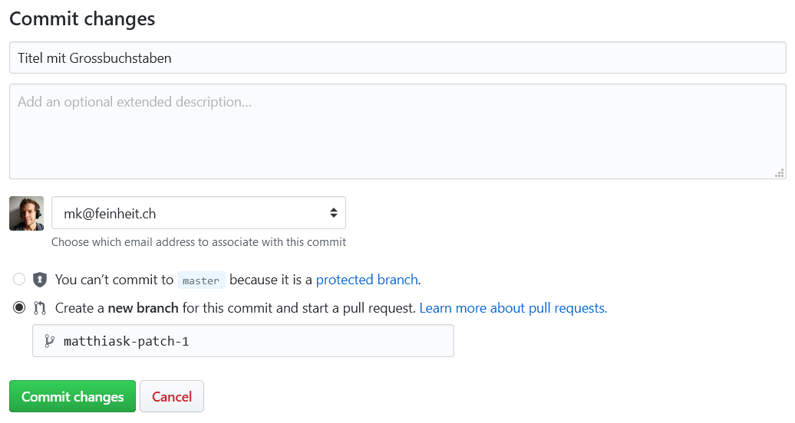
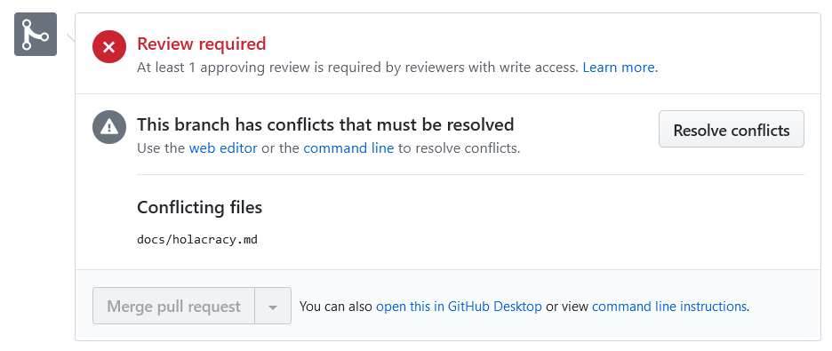
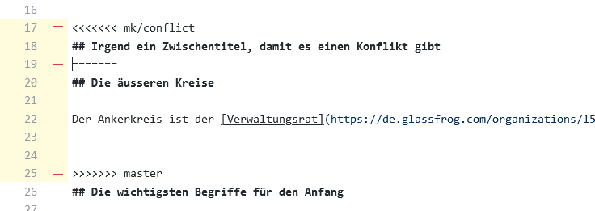
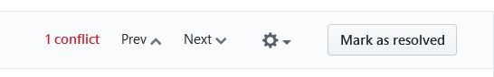

# Anleitung zur Bearbeitung

Denke daran, dass das Mitarbeiter*innenhandbuch öffentlich ist.

## Vorschläge machen

1. Suche die Textstelle, die du bearbeiten willst. Am besten, du klickst dazu auf das Bearbeitungs-Icon oben rechts:

    

2. Ändere die Textstelle. Wenn du fertig bist, kannst du deine Änderungen speichern ("committen"):

    
    Es ist hilfreich für die Reviewer*innen, wenn du den Änderung einen sinnvollen Titel verpasst. Jedoch nicht zwingend notwendig.

3. Erstelle den Pull Request, um deine gespeicherten Änderungen vorzuschlagen:

    
    Du hast in diesem Formular rechts die Möglichkeit, Reviewers für deinen Vorschlag auszuwählen. Dies ist eine gute Idee, wenn du gerne Feedback von bestimmten Menschen hättest, oder auch einfach verhindern willst, dass deine Änderung vergessen geht.

## Vorschläge akzeptieren

1. Öffne die [Liste der Vorschläge](https://github.com/feinheit/handbuch/pulls)

2. Wähle einen Vorschlag aus, und schau dir die Änderungen im Detail an. Wähle dazu die Files changed Ansicht:

    

3. Falls du mit den Änderungen einverstanden bist, kannst du deine Review abgeben. Aktuell ist mindestens eine positive Review notwendig, damit ein Vorschlag akzeptiert werden kann.

4. Wenn genügend positive Reviews zusammengekommen sind, kannst du den "Merge pull request" Button klicken. Falls die gleiche Textstelle in der Zwischenzeit eine inkompatible Änderung erhalten hat, muss der Edit-Konflikt von Hand behoben werden.

## Auflösen von Edit-Konflikten

Falls mehrere Vorschläge den gleichen Bereich im Handbuch betreffen, kann es geschehen, dass es Konflikte gibt welche von Hand aufgelöst werden müssen. In diesem Fall ist das Vorgehen wie folgt:

1. Klicke den "Resolve conflicts" Button:

    

2. Github zeigt dir die Konflikte an. Ein Beispiel eines Konflikts folgt:

    
   Zwischen ``<<<<<<<`` und ``=======`` befindet sich der Text des Vorschlags, zwischen ``=======`` und ``>>>>>>>`` der Text, welcher aktuell im Handbuch steht. Es gibt nun keine generell richtige Antwort für das Vorgehen. Was sicher ist: Die Zeilen mit den Konflikt-Markern (``<<<<<<<``, ``=======``  und ``>>>>>>>``) müssen raus, der Text zwischendrin sinnvoll zusammengeführt werden.

3. Sobald die Marker entfernt sind (und hoffentlich auch der Text zusammengeführt ist!) kannst du die Konflikte als aufgelöst markieren:

    

4. Wenn du alle Konflikte in allen Dateien aufgelöst hast, kannst du die Anpassungen am Vorschlag speichern:

    

## Für Fortgeschrittene

Alternativ kannst du Änderungen am Mitarbeiter*innenhandbuch natürlich auch lokal vorbereiten. Dazu musst du das Projekt klonen und den Server starten:

    git clone https://github.com/feinheit/handbuch.git
    cd handbuch
    ./serve

Am besten, du erstellst einen eigenen Branch für die Änderung:

    git checkout -b mk/neuer-abschnitt

Anschliessend die Änderungen committen und pushen:

    git commit -m "Neuer Abschnitt" -a
    git push origin mk/neuer-abschnitt

Nun musst du auf Github [einen Pull Request erstellen](https://github.com/feinheit/handbuch/compare) und eine Reviewer*in finden 😃
